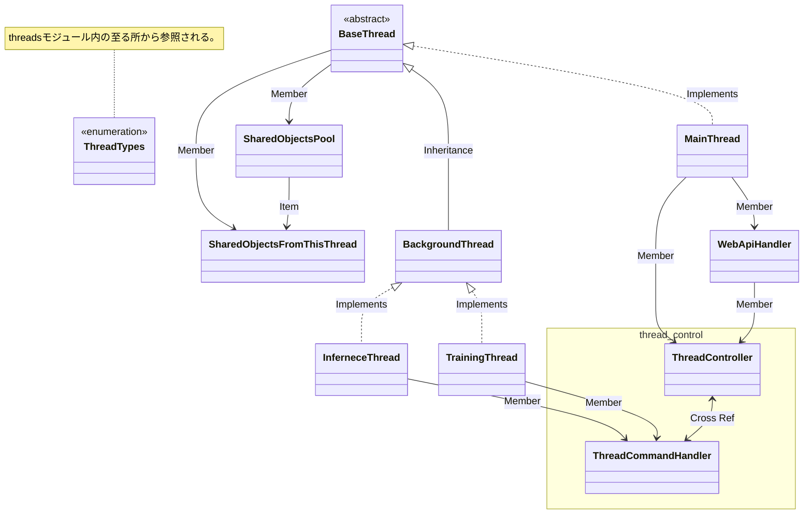

# プロジェクト構造について

## 概要

この資料では、AMIのモジュール、クラス、名前空間といったもののうち、骨子に関わる抽象クラス、重要実装クラスに関してその関係性等を記述する。

## AMI

### `threads` モジュール内部構造

```mermaid
classDiagram
    direction TB

    class ThreadTypes {<<enumeration>>}
    note for ThreadTypes "threadsモジュール内の至る所から参照される。"

    class BaseThread {
        <<abstract>>
    }
    BaseThread --> SharedObjectsPool: Member
    BaseThread --> SharedObjectsFromThisThread: Member
    SharedObjectsPool --> SharedObjectsFromThisThread: Item

    class SharedObjectsPool{
    }

    class SharedObjectsFromThisThread {
    }

    BaseThread <|.. MainThread: Implements
    class MainThread {

    }

    MainThread --> WebApiHandler: Member
    MainThread --> ThreadController: Member
    WebApiHandler --> ThreadController: Member

    BaseThread <|-- BackgroundThread: Inheritance
    class BackgroundThread {
    }

    BackgroundThread <|.. InferneceThread: Implements
    class InferneceThread {
    }
    InferneceThread --> ThreadCommandHandler: Member

    BackgroundThread <|.. TrainingThread: Implements
    class TrainingThread {
    }
    TrainingThread --> ThreadCommandHandler: Member

    namespace thread_control {
        class ThreadController{
        }

        class ThreadCommandHandler {
        }
    }
    ThreadController <--> ThreadCommandHandler: Cross Ref
```
