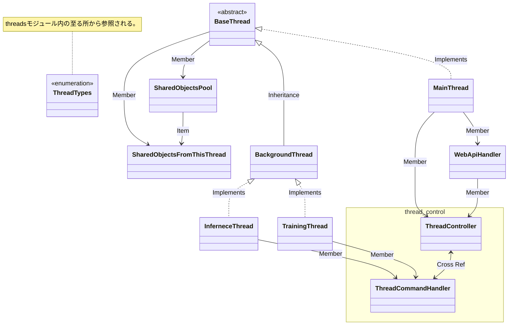
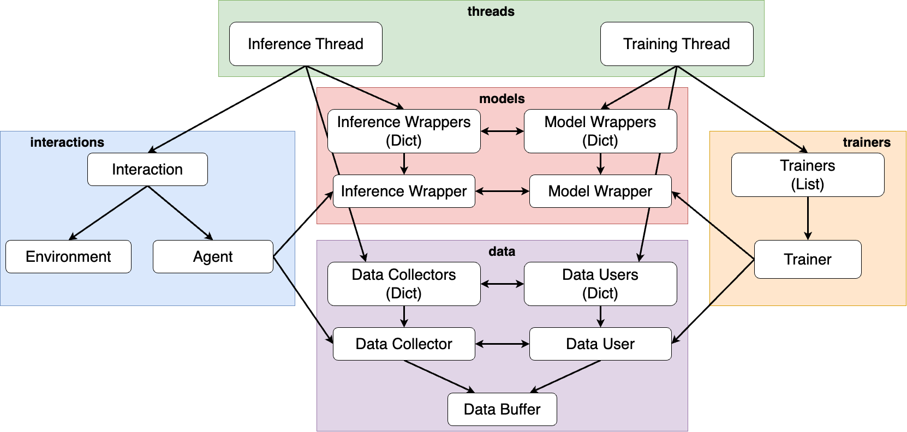
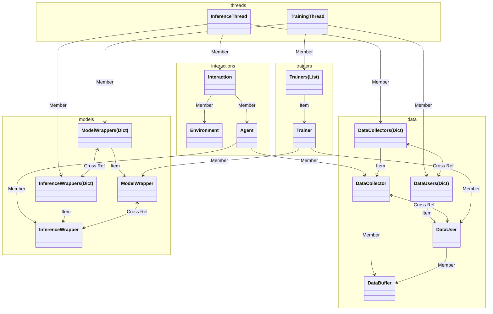

# プロジェクト構造について

## 概要

この資料では、AMIのモジュール、クラス、名前空間といったもののうち、骨子に関わる抽象クラス、重要実装クラスに関してその関係性等を記述する。

## AMI

### `threads` モジュール内部構造

### Inference - Training Relation

mermaidによるクラス図が非常に読みにくいため [draw.ioで作成した図](https://drive.google.com/file/d/1Iggc4oiVy6N04svYzsXPzqratjnqwSVc/view?usp=sharing)を最初に記載する。

